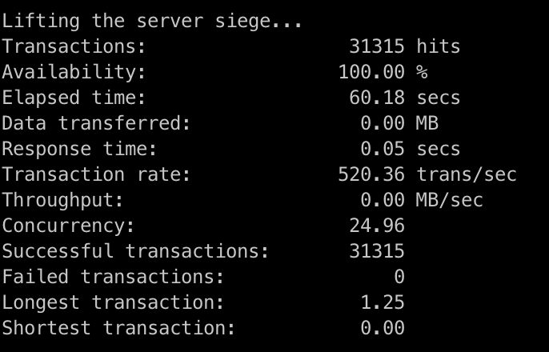
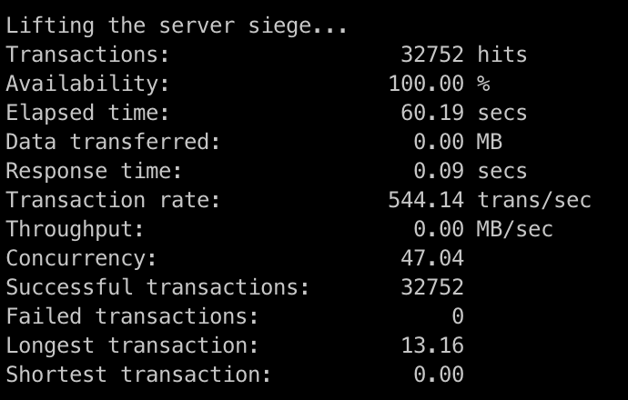
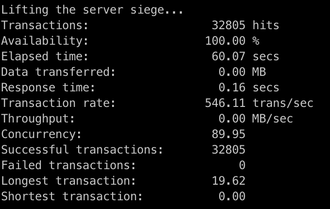
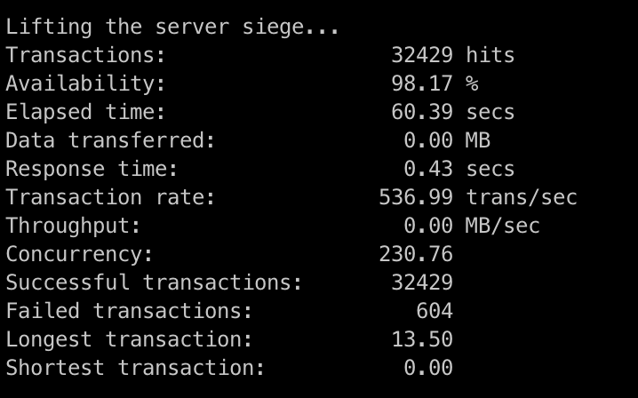
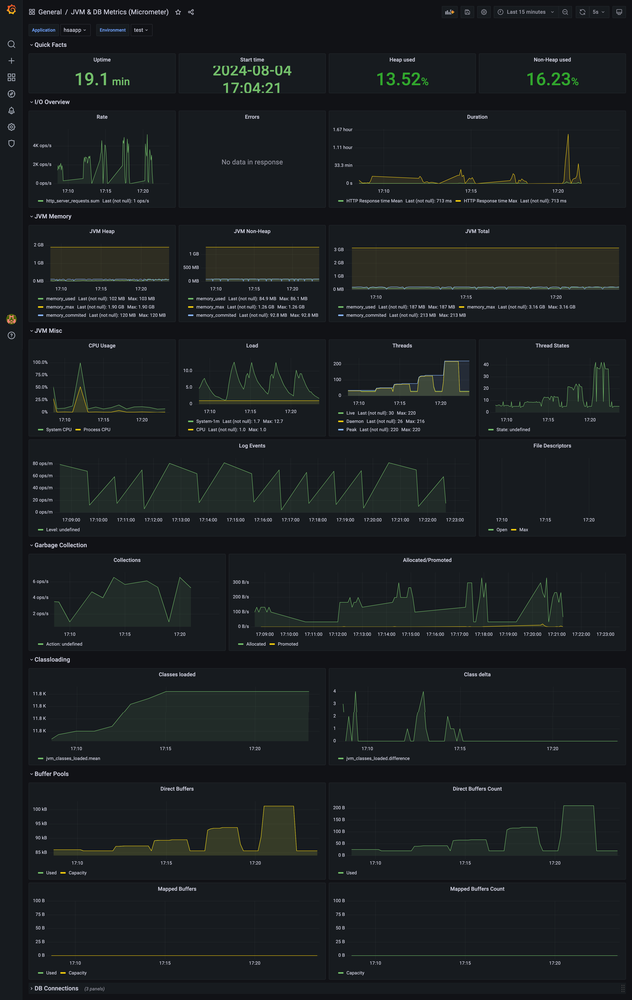

# HSA stress testing homework
HSA homework to cover stress testing tools and approaches

Tools:
- [Siege](https://github.com/JoeDog/siege/)

System under test: exposed HTTP api to store request payload into MongoDB

<h3>Load testing results </h3>

Concurrent users: 10  

Concurrent users: 25  

Concurrent users: 50  

Concurrent users: 100  

Concurrent users: 250  

JVM metrics collected  
